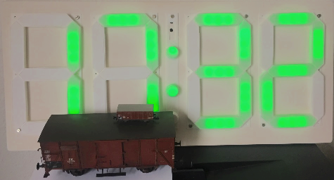
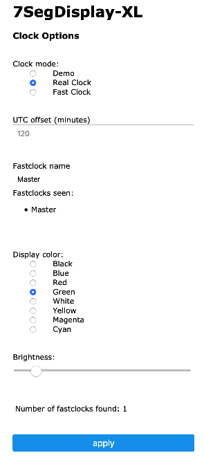

# 7-Segment FastClock / Counter Display

This is a controller for a LED driven 7-segment clock/counter display. An ESP8266 offers WiFi access for configuration/setting purpose and the ability to retrieve the current time through NTP.

But it might as well be used as a fast clock display for model railroads.

Prerequisites:

-   WS-2812 based adressable LED chain forming the 7-segment display
-   number of LEDs per segment is configurable

This is, how it could look like (fyi: the big cargo car is 1:45 scale, the small one is 1:160):

The configuration menu allows the selection of real or fast clock and some options like colors, fastclock name or UTC time offset for real time:

## Links / References

-   example of 3d printable segment frames
